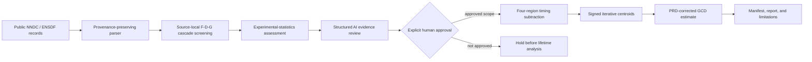

# AI Nuclear Spectroscopy

[](https://github.com/JWP-p/ai-nuclear-spectroscopy/actions/workflows/tests.yml)
[](LICENSE)
[](pyproject.toml)
[](docs/limitations.md)

**An open, auditable path from nuclear data to gamma-coincidence lifetime inference—for researchers and scientific agents learning to reason from evidence together.**

AI Nuclear Spectroscopy turns a research workflow that is often scattered across database queries, analysis scripts, plots, prompts, and expert memory into an explicit chain of evidence. It connects provenance-preserving NNDC/ENSDF retrieval, source-local cascade screening, experimental-statistics checks, structured AI review, a human approval boundary, and generalized centroid-difference (GCD) lifetime estimation.

This is not a code dump and it is not an automated claim generator. It is a compact reference implementation of how human expertise and machine assistance can meet on inspectable scientific ground: every candidate keeps its source identity, every recommendation carries supporting and opposing evidence, every lifetime estimate states its uncertainty scope, and every formal scientific decision remains with a qualified researcher.

> **Vision:** Make scientific reasoning visible enough that another physicist can challenge it, another laboratory can reproduce it, and a scientific agent can follow the same evidence without silently inventing missing steps.

## Why this project matters

Nuclear-spectroscopy analysis is not one calculation. It is a sequence of judgments: which evaluated record was used, whether transitions form a physically consistent path, whether all required peaks have usable statistics, how timing backgrounds were subtracted, whether the prompt-response-difference calibration applies, and which conclusions have passed human review. When those judgments remain implicit, neither people nor AI systems can reliably audit, reproduce, or improve the work.

This repository makes those decisions first-class data. Its value is the workflow contract:

- **For experimentalists:** a small, readable foundation for screening and documenting lifetime candidates.
- **For maintainers:** deterministic identifiers, provenance manifests, tests, and explicit release boundaries.
- **For scientific-agent builders:** structured evidence and counterevidence instead of unconstrained prose or hidden reasoning.
- **For the wider ecosystem:** a reusable example of AI assistance that preserves human scientific authority.

The long-term ambition is larger than any one isotope or detector setup: help build a scientific ecosystem in which human researchers and AI agents work from the same transparent evidence, improve one another's questions and tools, and develop better models of nature together. Public availability can make the workflow useful for education, benchmarking, agent evaluation, and future research; it does **not** imply that any organization will use this repository for model training.

## The evidence chain



The reference pipeline deliberately keeps three outcomes separate:

1. **Machine-supported recommendation** — a traceable prioritization, not a physics conclusion.
2. **Human-approved analysis scope** — permission to run a defined step, not a publication decision.
3. **Lifetime estimate** — an analysis output whose formal use still requires detector-specific validation, systematics, review, and collaboration authorization.

## What is implemented

- An opt-in NNDC ENSDF/XUNDL retrieval client that records URLs, retrieval time, dataset identifiers, byte count, and SHA-256.
- An inspectable subset parser for ENSDF identification, level, and gamma records.
- Deterministic, source-local three-transition cascade enumeration in both remote-gate orientations.
- Transparent signal-minus-scaled-background count assessment.
- Structured, deterministic agent-review records with claim, evidence, counterevidence, confidence, recommendation, and next action.
- A three-round selector–critic–synthesis trace that demonstrates iterative agent review offline before the human gate.
- An explicit human-approval gate before the timing stage.
- Four-region timing subtraction:

  ```text
  net = peak - scale_x * background_x - scale_y * background_y
        + scale_xy * background_xy
  ```

- Signed iterative centroids with convergence and two-cycle handling.
- A prompt-response-difference model, covariance propagation, and GCD lifetime estimate:

  ```text
  delta_C = C_delay - C_anti
  delta_R = R(E_decay) - R(E_feeder)
  tau     = (delta_C - delta_R) / 2
  T_1/2   = ln(2) * tau
  ```

- A fully deterministic synthetic end-to-end example, tests, public-surface scanning, and CI.

## Quick start

The package has no mandatory third-party runtime dependency.

```bash
git clone https://github.com/JWP-p/ai-nuclear-spectroscopy.git
cd ai-nuclear-spectroscopy
python3 -m venv .venv
source .venv/bin/activate
python -m pip install -e '.[dev]'
anspec demo --config configs/demo_workflow.json --output demo-output
```

The demo uses a fictional nucleus and deterministic synthetic timing spectra. Expected terminal fields include:

```json
{
  "stage": "GCD_ESTIMATED",
  "candidate_count": 4,
  "scientific_status": "SYNTHETIC_ESTIMATE_NOT_FORMAL_RELEASE"
}
```

Inspect the supported ENSDF subset:

```bash
anspec inspect-ensdf \
  --input examples/synthetic_ensdf/fictional_999xx.ens \
  --source-id SYNTHETIC_ENSDF_FIXTURE_V1
```

Retrieve public upstream records only when you explicitly choose to do so:

```bash
anspec fetch-ensdf \
  --nucleus 102Mo \
  --source ensdf \
  --output-dir local-data/102Mo
```

Upstream data are intentionally not vendored. Review the generated retrieval manifest and follow NNDC citation guidance before using fetched records in research.

## Demonstration outputs

Running the synthetic workflow creates:

| File | Purpose |
|---|---|
| `workflow_result.json` | Complete machine-readable evidence chain |
| `workflow_report.md` | Human-readable scientific summary and boundaries |
| `provenance_manifest.json` | Input hashes, configuration hash, software version, and generation time |

The demo is useful for software verification and agent-protocol experiments. It is not evidence for a real nucleus, detector, or lifetime.

## Repository map

```text
src/ai_nuclear_spectroscopy/  Reference implementation
configs/                      Synthetic and detector/PRD configuration examples
examples/                     Fictional ENSDF fixture and runnable walkthrough
prompts/                      Evidence-first scientific-agent protocols
docs/                         Architecture, methods, governance, vision, and limits
tests/                        Unit and end-to-end tests
tools/                        Public-release safety audit
```

Start with [the scientific workflow](docs/scientific_workflow.md), then read [the GCD method](docs/gcd_method.md), [the agent protocol](docs/agent_protocol.md), [the release verification](docs/verification.md), and [the scientific limitations](docs/limitations.md).

## Safety, provenance, and scientific boundaries

- The repository contains **no real experimental event data**, unpublished spectra, credentials, private keys, collaboration-only documents, or machine-specific paths.
- The bundled nuclear scheme and timing spectra are **fictional and synthetic**.
- The ENSDF parser is a documented subset, not a replacement for official NNDC/ENSDF tooling or evaluator judgment.
- AI outputs are review records, not authorship, approval, or authority.
- A passing test suite proves software behavior under its fixtures; it does not validate a detector response, a physical assignment, or a publishable lifetime.
- Users remain responsible for data rights, collaboration policy, source citation, calibration validity, uncertainty modeling, and formal scientific review.

See [data governance](docs/data_governance.md), [provenance and citation](docs/provenance_and_citation.md), [authorship and AI assistance](docs/authorship_and_ai.md), and [the public-release audit](docs/open_source_audit.md).

## Project status

Version `0.1.0` is an **alpha reference workflow**. Its synthetic vertical slice and public NNDC integration path are tested; real-experiment adapters, detector-specific validation, full ENSDF coverage, and formal release procedures remain outside this first public version.

## Contributing

Contributions that improve auditability, physical correctness, test coverage, documentation, or interoperability are welcome. The fastest way to start is:

1. Read [CONTRIBUTING.md](CONTRIBUTING.md) and [GOVERNANCE.md](GOVERNANCE.md).
2. Choose a focused issue or propose one before changing a scientific contract.
3. Use a branch and pull request; keep synthetic fixtures clearly synthetic.
4. Run `pytest`, `ruff check .`, `python tools/public_surface_audit.py`, and `python tools/validate_release_metadata.py`.
5. Describe evidence, counterevidence, uncertainty, and remaining scope in the pull request.

Good first contribution areas include ENSDF edge-case tests, GCD/PRD validation, synthetic ROOT/uproot adapters, agent-schema evaluation, and documentation. Read [SECURITY.md](SECURITY.md) for sensitive reports, and preserve the project's evidence-first and human-approval boundaries.

## Citation

If this software supports your work, cite the repository metadata in [CITATION.cff](CITATION.cff). Cite every nuclear-data evaluation and experimental source separately; software citation never replaces data citation.

## License

Copyright 2026 PanDa.

Licensed under the [Apache License 2.0](LICENSE). Third-party data and publications retain their own terms and are not redistributed by this repository.
