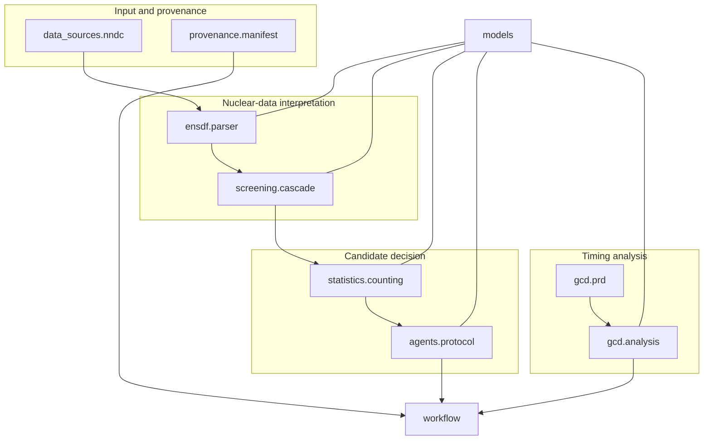

# Architecture

## Design objective

The project is organized around one question: **Can a scientific claim be traced back through every computational and human decision that produced it?**

The implementation therefore favors small modules, immutable records, deterministic identifiers, explicit status values, and files that can be inspected without a specialized platform. It is intentionally narrower than a production analysis framework.

## Component map

## Module responsibilities

### `data_sources.nndc`

Performs opt-in retrieval from the public NNDC ENSDF interface. Search results retain upstream dataset identifiers. A fetch produces content plus a manifest containing retrieval time, URL, content type, selected references, byte count, and SHA-256.

Network access is never required for the bundled demonstration or tests.

### `ensdf.parser`

Parses a deliberately documented subset of the ENSDF fixed-width format. Source line, raw energy, dataset title, and source identifier remain attached to parsed objects. Ambiguous or unclosed gamma placements receive explicit status instead of being guessed.

### `screening.cascade`

Builds only source-local, energy-closed three-transition chains. It generates feeder–decay–remote-gate candidates in both upstream and downstream gate orientations. Candidate identifiers are stable hashes of their source-local identity.

### `statistics.counting`

Computes net counts, Poisson-style uncertainty, significance, and a coarse status from an explicit signal window and scaled background window. It is a prioritization check, not a replacement for peak fitting or a detector-specific uncertainty model.

### `agents.protocol`

Produces structured review records with evidence and counterevidence. The current implementation is deterministic, which keeps the demonstration reproducible and makes the contract testable without a model API. A provider-backed agent can implement the same contract later.

### `gcd.prd` and `gcd.analysis`

Represent the prompt-response-difference function, propagate parameter covariance, perform four-region subtraction, compute signed iterative centroids, and estimate a mean life and half-life with explicit scientific status.

### `workflow`

Runs the vertical slice and writes two distinct surfaces:

- a complete machine-readable `WorkflowRecord`; and
- a concise human-readable report.

It requires an explicit human approval record before timing analysis.

## Core invariants

1. **No cross-source stitching.** A cascade is built within one parsed dataset and source identity.
2. **No silent placement.** Missing or ambiguous gamma closure remains a status, not an inferred transition.
3. **No implicit network dependency.** Tests and the demonstration are offline.
4. **No AI-only promotion.** A structured recommendation cannot authorize timing analysis or a formal result.
5. **No result without uncertainty scope.** Included and omitted uncertainty components are named.
6. **No collision between software and scientific status.** Software completion does not imply physical validity.

## Extension points

Production use will require adapters rather than edits to the core contracts:

- nuclear-data providers beyond the current NNDC interface;
- fuller ENSDF record parsing;
- ROOT or other histogram readers;
- detector-specific background and timing conventions;
- model-provider implementations of the review schema;
- independent systematic-variation and formal-release layers.

An extension should add a boundary object and tests before adding convenience automation.
