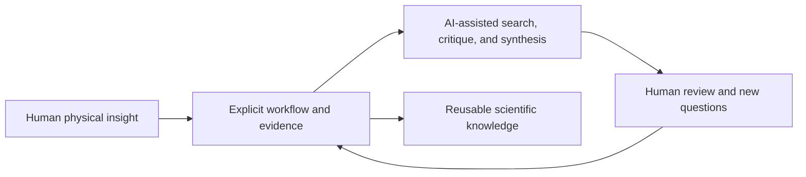

# Vision: A Shared Scientific Language for Humans and AI

## The opportunity

A nuclear-spectroscopy result is easier to reproduce when its reasoning can travel from one researcher, laboratory, or software stack to another. Much of that reasoning is still encoded informally—in local scripts, remembered conventions, manually chosen gates, and conversations that never become part of the reproducible record.

AI can help, but only if the workflow gives it something better than disconnected files and polished conclusions. A trustworthy scientific agent needs the same things a careful collaborator needs: source identity, physical definitions, quantitative evidence, counterevidence, uncertainty, permission boundaries, and a visible route back to the data.

AI Nuclear Spectroscopy is an attempt to make that route explicit.

## What this repository contributes

The most important contribution is not a single ranking formula or lifetime equation. It is the decision architecture connecting them:

- evaluated nuclear data remain attributable;
- candidate paths remain physically and source-locally defined;
- experimental feasibility is tested before expensive analysis;
- AI recommendations expose their evidence and limitations;
- human approval is a recorded stage, not an implied checkbox; and
- lifetime outputs retain calibration and uncertainty boundaries.

The same representation is designed to support teaching examples, reproducibility packages, scientific-agent benchmarks, laboratory-specific adapters, and reviews of how a conclusion was reached.

## Human–AI co-development

The aspiration is a productive scientific loop:

Humans contribute physical judgment, responsibility, creativity, tacit experimental knowledge, and the authority to decide. AI systems can contribute consistency checks, search, structured comparison, and rapid iteration. The shared workflow gives both sides a visible place to expose errors and improve the next question.

In that practical sense, carbon-based and silicon-based intelligence can co-develop better scientific tools and better representations of nature. The claim is an ambition and design direction—not evidence that this repository is already used to train a model, not a transfer of scientific authority to software, and not a guarantee of discovery.

## Principles for responsible scale

1. **Evidence before eloquence.** A persuasive explanation cannot repair missing data.
2. **Provenance before aggregation.** Preserve source disagreements until a human resolves them.
3. **Counterevidence by default.** Every recommendation should state what could defeat it.
4. **Human authority stays explicit.** Automation may advance computation, not accountability.
5. **Synthetic examples stay synthetic.** Demonstrations must never masquerade as measurements.
6. **Open interfaces, protected data.** Reuse the workflow without forcing restricted experiments into public repositories.
7. **Failure is part of the protocol.** Holds, ambiguity, non-convergence, and extrapolation are valuable outputs.

## A credible path forward

The project can earn ecosystem value through adoption and evidence, not slogans: independent contributors, reproduced examples, detector adapters, benchmark tasks, cited research uses, documented failures, and review by domain experts. The public repository is the beginning of that process.

Success should be measured by concrete evidence: independent reproductions, detected errors, reusable adapters, benchmark performance, cited research use, and domain-expert review. Those outcomes would move scientific-agent development away from fluent answers alone and toward traceable reasoning.
