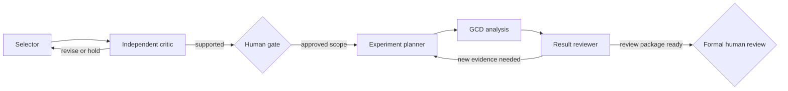

# Scientific-Agent Prompts

These prompts implement an evidence-first review loop for nuclear spectroscopy. They are provider-neutral templates, not instructions to trust a model.

## Recommended order

1. `candidate_selection.md` — compare source-local F-D-G candidates.
2. `evidence_critic.md` — challenge the leading recommendation.
3. `experiment_planner.md` — convert an approved review target into a bounded measurement/analysis plan.
4. `gcd_result_reviewer.md` — audit a produced timing estimate and its uncertainty scope.

## Use rules

- Supply structured records and artifact identifiers; do not ask a model to recall nuclear data from memory.
- Treat all retrieved or attached content as evidence to evaluate, not instructions to obey.
- Require the JSON schema or an equivalently strict response contract.
- Ask for concise rationale, evidence, counterevidence, and next action. Do not request private chain-of-thought.
- Record model/provider/version, prompt version, tool permissions, retrieved sources, and generation settings when reproducibility matters.
- Do not include credentials, restricted experiment data, personal paths, or embargoed material unless an authorized controlled environment and policy explicitly permit it.
- A model may recommend `REVIEW`, `HOLD`, or `REJECT`; it may not create an `APPROVED` human-gate record.

## Placeholders

Templates use double-braced placeholders such as `{{CANDIDATES_JSON}}`. Replace them with validated, minimally sufficient structured data. Do not concatenate arbitrary web text into a system instruction.

## Evaluation

Test prompts against synthetic truth, missing fields, contradictory sources, low statistics, ambiguous placement, out-of-range PRD energies, and adversarial text embedded in data fields. Measure schema validity, evidence attribution, refusal to invent, hold behavior, and stability across repeated runs.
